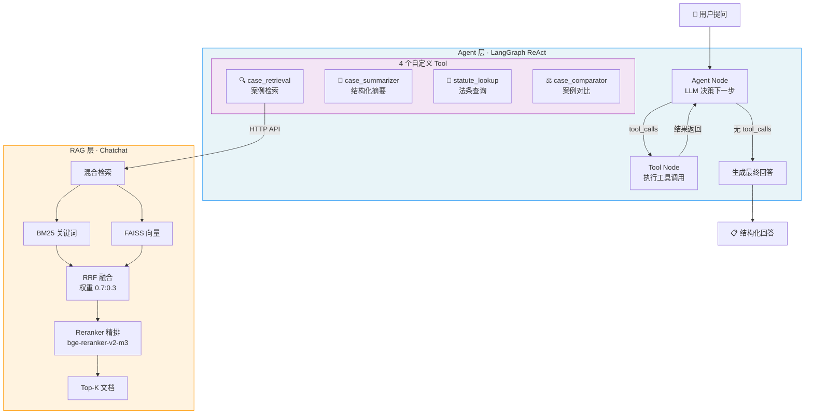

# 基于 RAG + LangGraph Agent 的司法典型案例智能遴选系统


司法典型案例遴选长期依赖人工审核，效率低且标准不统一。本项目基于 **Langchain-Chatchat** 深度改造，构建了 **RAG + Agent 双层架构**的智能遴选系统：底层 RAG 负责高质量检索，上层 Agent 负责复杂任务的自主推理与工具调度。

通过五阶段消融实验验证，系统总分从 **147 → 220**（满分 230），Agent 在多步推理维度取得 **满分 50/50**。

------

## 系统架构



**为什么分两层？**

| 层       | 角色                                     | 类比       |
| -------- | ---------------------------------------- | ---------- |
| Agent 层 | 决定做什么：拆解任务、选择工具、迭代推理 | 研究员     |
| RAG 层   | 执行检索：从知识库找到相关文档           | 图书管理员 |

两层通过 **HTTP API 解耦**，分别运行在独立的 Python 环境中，可独立迭代和部署。

------

## 核心改进

### 1. 结构感知分块

**问题**：默认 750 字硬切把法律文书的"推荐理由""专家评析"等段落切成两半，语义断裂。

**方案**：以法律文书固定段落（推荐理由、专家评析、裁判要旨等）为切块单元，保留段落级语义完整性。

**效果**：语义理解维度提升 **35%**。

### 2. BM25 + FAISS 混合检索

**问题**：纯向量检索对法条编号（如"第十四条"vs"第十五条"）区分度不够。

**方案**：修改 Chatchat 底层 `faiss_kb_service.py`，引入 BM25 关键词检索 + FAISS 向量检索双路召回，以 RRF 算法融合（权重 0.7:0.3）。

**效果**：法条类查询 Hit@5 从 **47% → 78%**（+31pp）。

### 3. Reranker 精排

**问题**：粗召回的 Top-10 文档中，排序不够精确。

**方案**：接入 bge-reranker-v2-m3 Cross-Encoder，对 (query, doc) 逐对打分做精排。相比 LLM 批量打分，Cross-Encoder 逐对编码避免了注意力分散导致的文档误杀问题。

**效果**：典型性判断维度提升 **12.5%**。

### 4. LangGraph Agent 多步推理

**问题**：纯 RAG 只能做一轮检索 + 一轮生成，无法处理"对比两类案例""总结规律"等复杂任务。

**方案**：基于 LangGraph 构建 ReAct 风格 Agent，通过 Function Calling 自主调度 4 个工具，支持多轮检索、摘要、对比的推理链。

**效果**：多步推理维度取得 **满分 50/50**，纯 RAG 无法完成的跨案例对比等任务完成率达 **100%**。

------

## 消融实验

六维评估集（50 题），五阶段逐步叠加组件：

| 配置           | 总分          | 提升       | 说明                  |
| -------------- | ------------- | ---------- | --------------------- |
| A: Baseline    | 147 / 230     | —          | 750 字硬切 + 纯 FAISS |
| B: +结构化切块 | 171 / 230     | +16.3%     | 段落级切块            |
| C: +混合检索   | 185 / 230     | +8.2%      | BM25 + FAISS + RRF    |
| D: +Reranker   | 192 / 230     | +3.8%      | bge-reranker-v2-m3    |
| **E: +Agent**  | **220 / 230** | **+14.6%** | LangGraph ReAct       |

> 每个组件均呈正向贡献，消融曲线单调递增。

**各维度得分明细：**

| 维度       | 满分 | A    | B    | C    | D    | E      |
| ---------- | ---- | ---- | ---- | ---- | ---- | ------ |
| 精确检索   | 40   | 34   | 38   | 38   | 37   | 40     |
| 语义理解   | 40   | 26   | 35   | 28   | 32   | 39     |
| 典型性判断 | 40   | 27   | 32   | 32   | 36   | 38     |
| 抗干扰     | 40   | 38   | 40   | 39   | 39   | 33     |
| 多步推理   | 50   | 10   | 11   | 31   | 30   | **50** |
| 一致性     | 20   | 12   | 15   | 17   | 18   | 20     |

------

## 技术栈

| 类别      | 技术                                  |
| --------- | ------------------------------------- |
| LLM       | GLM-4 / Qwen2.5                       |
| Embedding | bge-large-zh-v1.5                     |
| Reranker  | bge-reranker-v2-m3（Cross-Encoder）   |
| 向量库    | FAISS                                 |
| 检索      | BM25 + FAISS + RRF 融合               |
| Agent     | LangGraph（ReAct + Function Calling） |
| RAG 框架  | Langchain-Chatchat 0.3.1.3            |
| 前端      | Streamlit                             |
| API       | FastAPI                               |

------

## 项目结构

```
├── agent/                        # Agent 模块（独立环境运行）
│   ├── graph.py                  # LangGraph 状态图（ReAct 循环核心）
│   ├── tools.py                  # 4 个自定义 Tool
│   ├── reranker.py               # bge-reranker-v2-m3 精排模块
│   ├── config.py                 # 配置（API 地址、模型、知识库）
│   ├── run.py                    # CLI 测试入口
│   └── eval_runner.py            # 评估脚本（支持 C/D/E 三模式）
├── chatchat_patches/             # Chatchat 源码修改
│   └── faiss_kb_service.py       # BM25 + FAISS 混合检索改造
├── data_processing/              # 数据处理
│   ├── process_cases.py          # 案例 JSON 预处理 + 语义归一化
│   └── upload_chunks.py          # 结构化切块上传知识库
├── evaluation/                   # 评估数据
│   ├── eval_results_C.json       # 配置 C（混合检索 RAG）结果
│   ├── eval_results_D.json       # 配置 D（+Reranker）结果
│   └── eval_results_E.json       # 配置 E（+Agent）结果
├── app.py                        # Streamlit 可视化前端
├── requirements.txt              # 依赖
├── start_chatchat.bat            # 一键启动 RAG 服务
└── start_agent.bat               # 一键启动 Agent 前端
```

------

## 快速启动

### 环境准备

本项目需要两个独立的 conda 环境（因 Chatchat 和 LangGraph 的 langchain-core 版本不兼容）：

```bash
# 环境 1：RAG 服务
conda create -n chatchat python=3.10
conda activate chatchat
pip install langchain-chatchat==0.3.1.3

# 环境 2：Agent 服务
conda create -n agent python=3.10
conda activate agent
pip install -r requirements.txt
```

### 启动服务

```bash
# 终端 1：启动 RAG 服务（Chatchat API）
conda activate chatchat
chatchat start -a
# 服务地址：http://127.0.0.1:7861

# 终端 2：启动 Agent 前端
conda activate agent
streamlit run app.py
# 访问地址：http://localhost:8501
```

### 运行评估

```bash
conda activate agent

# 测试单道题
python -m agent.eval_runner --mode E --qid Q33

# 按维度测试
python -m agent.eval_runner --mode C D E --dim 多步推理

# 完整评估（50 题 × 3 模式）
python -m agent.eval_runner --mode C D E
```

------

## Agent 推理示例

**输入**：对比农民工工伤赔偿和交通事故赔偿两类案例在赔偿标准上的差异。

**Agent 推理链**：

| Step | 操作                                         | 说明                   |
| ---- | -------------------------------------------- | ---------------------- |
| 1    | 🔍 `case_retrieval("农民工工伤赔偿典型案例")` | 检索工伤案例           |
| 2    | 🔍 `case_retrieval("交通事故赔偿典型案例")`   | 检索交通案例           |
| 3    | 📝 `case_summarizer(工伤案例)`                | 提取裁判要旨与赔偿标准 |
| 4    | 📝 `case_summarizer(交通事故案例)`            | 提取裁判要旨与赔偿标准 |
| 5    | ⚖️ `case_comparator("赔偿标准")`              | 对比赔偿标准差异       |
| 6    | ⚖️ `case_comparator("赔偿主体")`              | 对比责任主体差异       |
| 7    | 📋 生成最终回答                               | 三维度对比报告         |

> 纯 RAG 只能做 Step 1 + Step 7（一次检索、一次生成），Agent 自主完成了 7 步推理。

------

## 许可证

本项目仅用于学术研究和学习交流，不用于商业用途。
